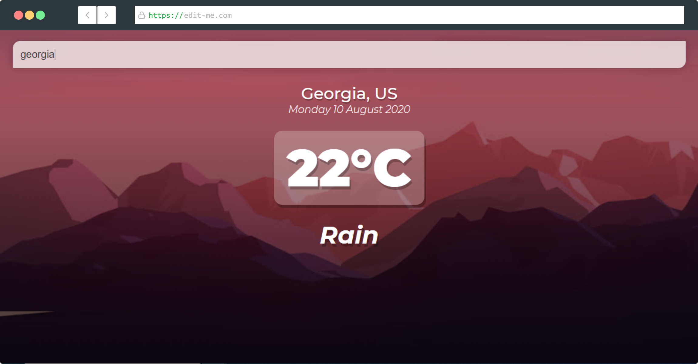
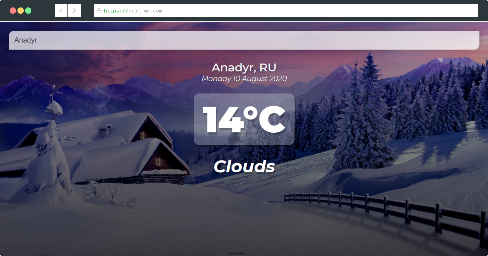

# Vue Weather App ☁


## About 🌡

The ___[app](https://fathomless-falls-25481.herokuapp.com/)___ is a weather application, which shows the temperature of different cities and countries around the world. Depending on the temperature, the background image changes from cold to hot. This gives a visual aid to the user. 

For this project, I used the __[OpenWeatherMap API](https://openweathermap.org/api)__, to find the live weather forcast.

The frontend of the website was made completely in [Vue.Js](https://vuejs.org/) and [Heroku](https://heroku.com/) was used to deploy and host the web application. 

This application was made using [Vue.Js](https://vuejs.org/). This was the first time that I was using Vue. 

__[Demo Weather App](https://fathomless-falls-25481.herokuapp.com/)__

<br>

## Screenshots




## Project setup 👨‍💻
```
yarn install
```

### Compiles and hot-reloads for development
```
yarn run serve
```

### Compiles and minifies for production
```
yarn build
```

### Lints and fixes files
```
yarn lint
```


